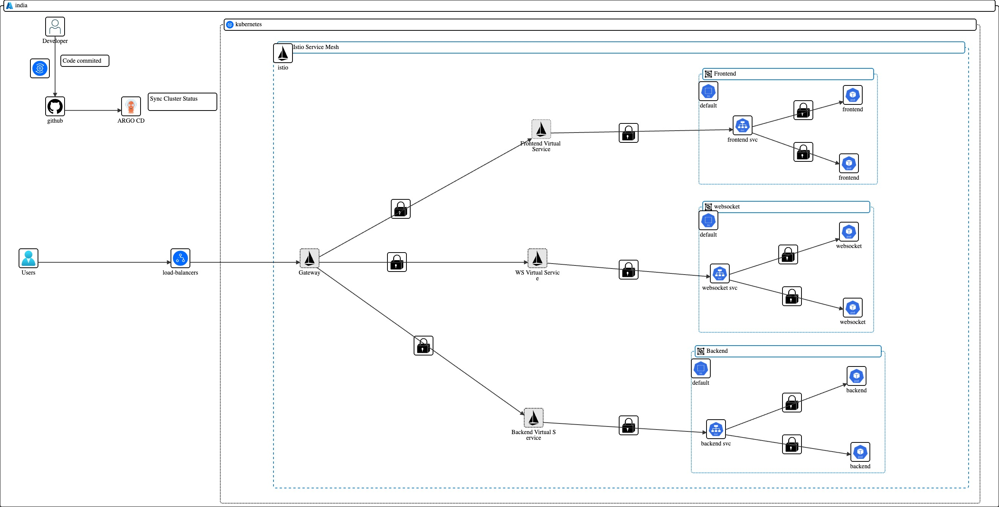

# 🎨 DoodleMesh

DoodleMesh is a real-time collaborative drawing app that allows multiple users to draw simultaneously in shared rooms. Built with a microservices architecture and deployed on a Kubernetes cluster using modern DevOps practices.

## 🌐 Live App

**🌍 [draw.kushan23.com](https://draw.kushan23.com)**

---

## 🧠 Architecture Overview

DoodleMesh is composed of three primary services:

1. **Frontend** – Built with **Next.js**, handles authentication, room management, and canvas UI.
2. **Backend API** – Built with **Node.js**, handles user auth, room metadata, and data persistence.
3. **WebSocket Server** – Built with **Node.js**, enables real-time drawing sync between users.

These services are containerized and deployed via **GitHub Actions**, with ArgoCD managing continuous delivery to a Kubernetes cluster on **Civo Cloud**.

---

## 🚀 DevOps & Deployment Highlights

- **Monorepo** hosted in a GitHub Organization: [Doodle](https://github.com/DoodleMesh)
- **CI/CD**: GitHub Actions builds Docker images and pushes K8s manifests to a deployment repo.
- **CD**: ArgoCD watches the deployment repo and syncs manifests to the cluster.
- **Kubernetes**:
  - Hosted on **DigitalOcean Kubernetes Service**
  - Uses **Istio Service Mesh** for traffic routing and secure HTTPS ingress.
  - Frontend accessible at: [draw.kushan23.com](https://draw.kushan23.com)
- **Cert-Manager** + **Let's Encrypt** for automatic HTTPS certificates.
- **Namespace-separated deployments** with full SSL/TLS support.

---

## 🧪 Features

- 🖌️ Real-time collaborative drawing
- 👥 Room-based user sessions
- 🔒 Auth system for login/register
- 🧩 Shapes: Rectangle, Circle, Line, Freehand
- 📡 WebSocket-based live sync
- 🌈 Responsive canvas and UX-first interface

---

## 🛠️ Tech Stack

| Layer        | Tech                     |
|--------------|--------------------------|
| Frontend     | Next.js, TypeScript      |
| Backend API  | Node.js, Express, Prisma |
| Realtime     | Node.js, WebSocket       |
| Database     | PostgreSQL (via Prisma)  |
| CI/CD        | GitHub Actions, ArgoCD   |
| Infra        | Kubernetes, Istio, DO    |
| TLS/Ingress  | Cert-Manager, Let's Encrypt |

---

## 📦 Repository Structure

**🔗 GitHub Organization:** [`DoodleMesh`](https://github.com/DoodleMesh)

---

### 🔧 Application Code Repositories

| Repository | Description | Tech Stack |
|------------|-------------|------------|
| [`doodle-frontend`](https://github.com/DoodleMesh/doodle-frontend) | Frontend for DoodleMesh | Next.js |
| [`doodle-backend`](https://github.com/DoodleMesh/doodle-backend) | REST API server | Node.js, Express, Prisma |
| [`doodle-ws`](https://github.com/DoodleMesh/doodle-ws) | Real-time collaboration server | Node.js, WebSocket |

---

### 🚀 Kubernetes Manifests for ArgoCD

| Repository | Purpose | Includes |
|------------|---------|----------|
| [`argo-frontend`](https://github.com/DoodleMesh/argo-frontend) | Frontend deployment manifests | K8s YAML, ArgoCD Application |
| [`argo-backend`](https://github.com/DoodleMesh/argo-backend) | Backend deployment manifests | K8s YAML, ArgoCD Application |
| [`argo-ws`](https://github.com/DoodleMesh/argo-ws) | WebSocket deployment manifests | K8s YAML, ArgoCD Application |

---

### ⚙️ CI/CD Workflow

Each application repository includes a **GitHub Actions** pipeline that:

- 🏗️ **Builds** and pushes Docker images to the container registry  
- 📝 **Commits** updated Kubernetes manifests to the ArgoCD manifest repos  
- 🔁 **Triggers** automatic deployment through **ArgoCD**

---

---

## 📡 Architecture Overview

> 🔍 This diagram explains the interaction between components, services, and the infrastructure layer including Istio Gateway, ArgoCD.

---

## 🌐 Domain + TLS Setup

- Managed via **Istio Gateway** + **VirtualServices**
- HTTPS only (`443`) via `cert-manager` and **Let's Encrypt ClusterIssuer**
- TLS certificate auto-renewal with `.well-known` challenge path routing

---

## 🔄 CI/CD Pipeline

1. Push to `develop` in any source repo triggers GitHub Actions.
2. Docker image is built and pushed to the container registry.
3. Updated Kubernetes manifests are committed to the corresponding Argo repo.
4. ArgoCD syncs the new configuration to the Kubernetes cluster automatically.

---

## 🙋‍♂️ Author

**Kushan Arora**  
🧠 Full-stack Developer | DevOps Enthusiast | Cloud Native Builder  
🔗 [LinkedIn](https://linkedin.com/in/kushan23)

---

## 📌 License

MIT License
